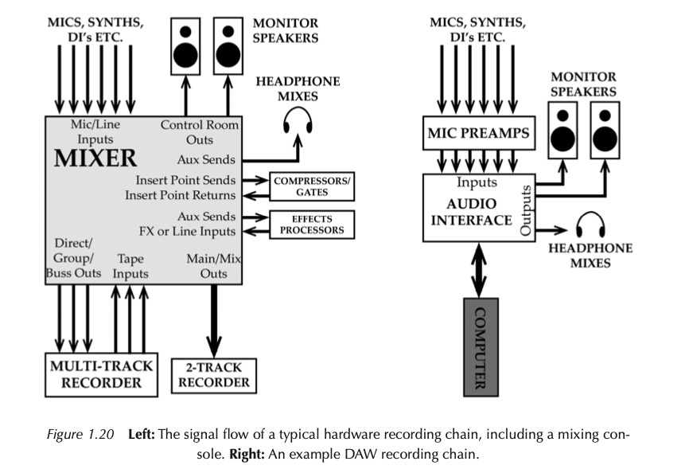
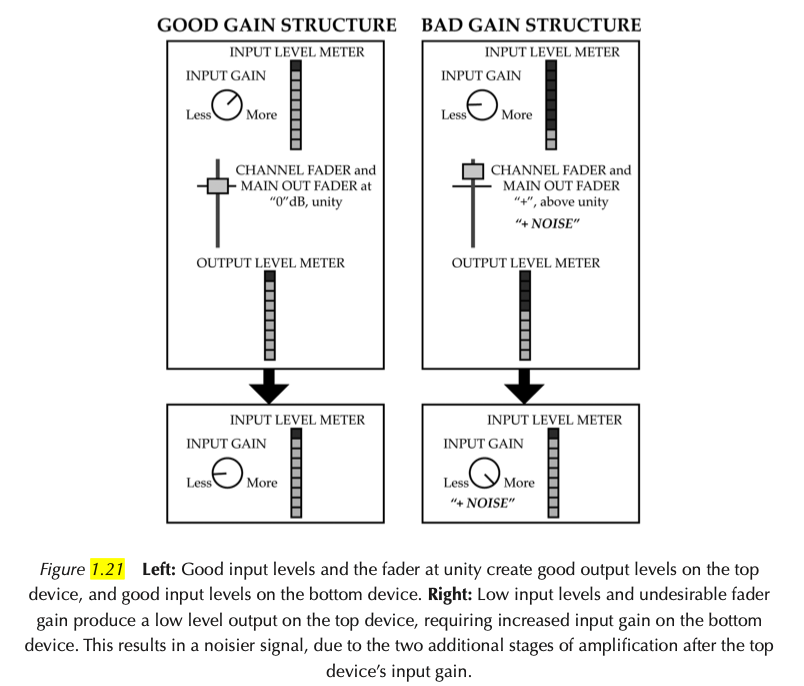

+++
title = "Audio Basics"
outputs = ["Reveal"]
[logo]
src = "github-logo.png"
[reveal_hugo]
custom_theme = "reveal-hugo/themes/robot-lung.css"
margin = 0.2
separator = "##"
+++

# Audio Basics

---

What's more important? The mic or the engineer?

---

{}
Why is this important to know in a recording class?
{}

---

## The Decibel (dB)

> The amplitude of a sound's energy is measured in decibels.

{}
We could measure sound in watts, but the scale would be too large to make sense to use in daily life.

To make the scale more manageable we shrink it logarithmically to a smaller range of numbers.

Does anyone know what the unit of the dB scale for sound is?
{}

---

## Power relationships

Sound Pressure Level - a measure of how loud a sound actually is, where you’re listening to it or measuring it.

[Audio examples](https://routledgetextbooks.com/textbooks/9780367470364/audio_files.php)

{}

- If the vocal is “slightly” too quiet, increasing the vocal fader level by +3 dB will make it “slightly louder” – and should come close to correcting the problem.
- If you’re thinking, “the sax needs to be half as loud,” then you should be able to make an informed judgment, reduce the sax fader level by about −9 dB, and come close to correcting the problem.

{}

---

## Decibel Scales

- dB SPL - sound pressure level
- dBV - volt
- dBu - VU or Volume Unit
- dBFS - decibels (relative to) full scale
- LUFS - Loudness Units Full Scale
  - -14 LUFS is a common target

{}

**dB SPL** is a measure of how loud a sound actually is in an environment, at a specifc point in space. It is measured with an SPL meter. The most commonly encountered SPL scale is 0 to 140 dB SPL – which is based on the human ear’s threshold of hearing (0 dB SPL) and thresh- old of pain (130 dB SPL). The SPL scale does in fact go up to about 194 dB SPL – which is the point at which the air cannot handle the amount of sonic energy, and distorts the sound.

**dBV (decibel volt)** scales are used on analog audio equipment, or digital devices and soft- ware trying to emulate an analog experience. They are a measure of the electrical voltage representing the sound wave. Bargraph meters commonly use dBV scales. Their range is usually −∞ dBV (or some negative value) through 0 dBV, to approximately +15 or +18 dBV. Figure 1.3 shows some typical dBV meters.

dBFS - “Full scale” is the maximum amplitude a digital device can handle without horrible distortion, and is labeled 0 dBFS. A dBFS meter’s range is from −∞ dB (or some detectable negative value) up to 0 dBFS. The only thing above 0 dBFS is the “clip” or “over” indicator.

Loudness Units Full Scale metering represents perceived loudness in a way that correlates to human perception.

{}

---

### Signal Flow

{}

Basic signal flow for a hardware and software based setup. See our routing diagram for what the studio is doing. It's much more complex.

{}

---

## Audio Level Standards

- mic level
- line level
- loudspeaker level
- Instrument level

{}

- mic level - Because a mic level is low, it requires amplification with a preamp before it is recorded.
- Line levels - A preamp applies gain (amplifcation) to the mic level signal to raise it to line level, which is the level the rest of the mixing console (or audio interface) operates at. There are two standards for line level signals:
  - “+4 dBu” or professional level represents the audio waveform as voltages of up to about ±1.7 V.
  - “−10 dBV” or consumer level represents the audio waveform as voltages of up to about ±0.4 V.
- Electric guitars and basses have instrument level connections. In terms of signal level, they are not dissimilar to mic level – so plugging a guitar or bass directly into a mic input will usually result in decent levels. However the impedances (the electrical load each device presents to the other) of the two devices are not designed to work together – and the sound will be muddy and dull. Some audio interfaces and preamps have an instrument input or two on them. If yours does not, you will need to use a direct box or DI, or a dedicated instrument preamp to convert the instrument signal level and impedance, if you wish to plug a guitar or bass directly into your recording chain.

{}

---

## Gain Structure and Recording Levels

{}

- If too low a signal enters a device, that device will add a greater relative percentage of its own hiss and noise to the signal. That extra noise will end up being turned up to compensate for the low input level somewhere later in the signal fow.
- If too high a level enters a device, then subtle or not so subtle distortion will result.
- Peak between -12 and -6

{}

---

---

## Analog audio connectors

- XLR - microphones
- 1/4
  - TRS (Tip Ring Sleeve) - line level
  - TS (Tip Sleeve) - instrument level
- RCA

{}

Have each person go grab an example of these cables.

{}
